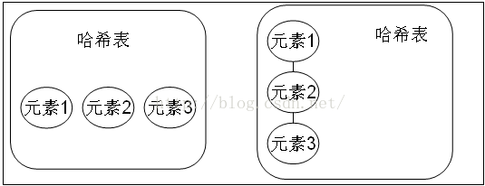
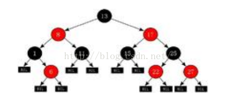

# Java Set集合的详解

一，Set
Set:注重独一无二的性质,该体系集合可以知道某物是否已近存在于集合中,不会存储重复的元素
用于存储无序(存入和取出的顺序不一定相同)元素，值不能重复。

对象的相等性

引用到堆上同一个对象的两个引用是相等的。如果对两个引用调用hashCode方法，会得到相同的结果，
如果对象所属的类没有覆盖Object的hashCode方法的话，hashCode会返回每个对象特有的序号（java是依据对象的内存地址计算出的此序号），
所以两个不同的对象的hashCode值是不可能相等的。

如果想要让两个不同的Person对象视为相等的，就必须覆盖Object继下来的hashCode方法和equals方法，
因为Object hashCode方法返回的是该对象的内存地址，所以必须重写hashCode方法，
才能保证两个不同的对象具有相同的hashCode，同时也需要两个不同对象比较equals方法会返回true，
该集合中没有特有的方法，直接继承自Collection。

```
---| Itreable      接口 实现该接口可以使用增强for循环  
                ---| Collection     描述所有集合共性的接口  
                    ---| List接口     可以有重复元素的集合  
                            ---| ArrayList     
                            ---|  LinkedList  
                    ---| Set接口      不可以有重复元素的集合 
```

案例：set集合添加元素并使用迭代器迭代元素。

```java
public class Demo4 {  
    public static void main(String[] args) {  
        //Set 集合存和取的顺序不一致。  
        Set hs = new HashSet();  
        hs.add("世界军事");  
        hs.add("兵器知识");  
        hs.add("舰船知识");  
        hs.add("汉和防务");  
        System.out.println(hs);  
        // [舰船知识, 世界军事, 兵器知识, 汉和防务]  
        Iterator it = hs.iterator();  
        while (it.hasNext()) {  
            System.out.println(it.next());  
        }  
    }  
}  
```

二，HashSet

```
---| Itreable      接口 实现该接口可以使用增强for循环  
                ---| Collection     描述所有集合共性的接口  
                    ---| List接口     可以有重复元素的集合  
                            ---| ArrayList     
                            ---|  LinkedList  
                    ---| Set接口      不可以有重复元素的集合  
                            ---| HashSet  线程不安全，存取速度快。底层是以哈希表实现的。  
```

HashSet

哈希表边存放的是哈希值。HashSet存储元素的顺序并不是按照存入时的顺序（和List显然不同） 是按照哈希值来存的所以取数据也是按照哈希值取得。

HashSet不存入重复元素的规则.使用hashcode和equals

由于Set集合是不能存入重复元素的集合。那么HashSet也是具备这一特性的。HashSet如何检查重复？
HashSet会通过元素的hashcode（）和equals方法进行判断元素师否重复。

当你试图把对象加入HashSet时，HashSet会使用对象的hashCode来判断对象加入的位置。同时也会与其他已经加入的对象的hashCode进行比较，
如果没有相等的hashCode，HashSet就会假设对象没有重复出现。

简单一句话，如果对象的hashCode值是不同的，那么HashSet会认为对象是不可能相等的。

因此我们自定义类的时候需要重写hashCode，来确保对象具有相同的hashCode值。

如果元素(对象)的hashCode值相同,是不是就无法存入HashSet中了? 当然不是,会继续使用equals 进行比较.
如果equals为true那么HashSet认为新加入的对象重复了,所以加入失败。
如果equals 为false那么HashSet 认为新加入的对象没有重复.新元素可以存入.

总结：

元素的哈希值是通过元素的hashcode方法 来获取的, HashSet首先判断两个元素的哈希值，如果哈希值一样，
接着会比较equals方法 如果 equls结果为true ，HashSet就视为同一个元素。如果equals 为false就不是同一个元素。

哈希值相同equals为false的元素是怎么存储呢,就是在同样的哈希值下顺延（可以认为哈希值相同的元素放在一个哈希桶中）。也就是哈希一样的存一列。

hashtable



图1：hashCode值不相同的情况

图2：hashCode值相同，但equals不相同的情况。

HashSet：通过hashCode值来确定元素在内存中的位置。一个hashCode位置上可以存放多个元素。

当hashcode() 值相同equals() 返回为true 时,hashset 集合认为这两个元素是相同的元素.只存储一个（重复元素无法放入）。
调用原理:先判断hashcode 方法的值,如果相同才会去判断equals 如果不相同,是不会调用equals方法的。


HashSet到底是如何判断两个元素重复。

通过hashCode方法和equals方法来保证元素的唯一性，add()返回的是boolean类型

判断两个元素是否相同，先要判断元素的hashCode值是否一致，只有在该值一致的情况下，才会判断equals方法，
如果存储在HashSet中的两个对象hashCode方法的值相同equals方法返回的结果是true，那么HashSet认为这两个元素是相同元素，
只存储一个（重复元素无法存入）。

注意：HashSet集合在判断元素是否相同先判断hashCode方法，如果相同才会判断equals。如果不相同，是不会调用equals方法的。

HashSet 和ArrayList集合都有判断元素是否相同的方法，

boolean contains(Object o)

HashSet使用hashCode和equals方法，ArrayList使用了equals方法


案例：

使用HashSet存储字符串，并尝试添加重复字符串

回顾String类的equals()、hashCode()两个方法。

```java
public class Demo4 {  
    public static void main(String[] args) {  
        // Set 集合存和取的顺序不一致。  
        Set hs = new HashSet();  
        hs.add("世界军事");  
        hs.add("兵器知识");  
        hs.add("舰船知识");  
        hs.add("汉和防务");  
  
        // 返回此 set 中的元素的数量  
        System.out.println(hs.size()); // 4  
  
        // 如果此 set 尚未包含指定元素，则返回 true  
        boolean add = hs.add("世界军事"); // false  
        System.out.println(add);  
  
        // 返回此 set 中的元素的数量  
        System.out.println(hs.size());// 4  
        Iterator it = hs.iterator();  
        while (it.hasNext()) {  
            System.out.println(it.next());  
        }  
    }  
}  
```

使用HashSet存储自定义对象，并尝试添加重复对象（对象的重复的判定）

```java
public class Demo4 {  
    public static void main(String[] args) {  
        HashSet hs = new HashSet();  
        hs.add(new Person("jack", 20));  
        hs.add(new Person("rose", 20));  
        hs.add(new Person("hmm", 20));  
        hs.add(new Person("lilei", 20));  
        hs.add(new Person("jack", 20));  
  
        Iterator it = hs.iterator();  
        while (it.hasNext()) {  
            Object next = it.next();  
            System.out.println(next);  
        }  
    }  
}  
  
class Person {  
    private String name;  
    private int age;  
  
    Person() {  
  
    }  
  
    public Person(String name, int age) {  
  
        this.name = name;  
        this.age = age;  
    }  
  
    public String getName() {  
        return name;  
    }  
  
    public void setName(String name) {  
        this.name = name;  
    }  
  
    public int getAge() {  
        return age;  
    }  
  
    public void setAge(int age) {  
        this.age = age;  
    }  
  
    @Override  
    public int hashCode() {  
        System.out.println("hashCode:" + this.name);  
        return this.name.hashCode() + age * 37;  
    }  
  
    @Override  
    public boolean equals(Object obj) {  
        System.out.println(this + "---equals---" + obj);  
        if (obj instanceof Person) {  
            Person p = (Person) obj;  
            return this.name.equals(p.name) && this.age == p.age;  
        } else {  
            return false;  
        }  
    }  
  
    @Override  
    public String toString() {  
  
        return "Person@name:" + this.name + " age:" + this.age;  
    }  
  
}  
```

问题：现在有一批数据，要求不能重复存储元素，而且要排序。ArrayList 、 LinkedList不能去除重复数据。HashSet可以去除重复，但是是无序。

所以这时候就要使用TreeSet了

三，TreeSet

案例：使用TreeSet集合存储字符串元素，并遍历

```java
public class Demo5 {  
    public static void main(String[] args) {  
        TreeSet ts = new TreeSet();  
        ts.add("ccc");  
        ts.add("aaa");  
        ts.add("ddd");  
        ts.add("bbb");  
  
        System.out.println(ts); // [aaa, bbb, ccc, ddd]  
  
    }  
}  
```

```
---| Itreable      接口 实现该接口可以使用增强for循环  
                ---| Collection     描述所有集合共性的接口  
                    ---| List接口     有序，可以重复，有角标的集合  
                            ---| ArrayList     
                            ---|  LinkedList  
                    ---| Set接口      无序，不可以重复的集合  
                            ---| HashSet  线程不安全，存取速度快。底层是以hash表实现的。  
                            ---| TreeSet  红-黑树的数据结构，默认对元素进行自然排序（String）。如果在比较的时候两个对象返回值为0，那么元素重复。  
```

红-黑树

红黑树是一种特定类型的二叉树



红黑树算法的规则: 左小右大。

既然TreeSet可以自然排序,那么TreeSet必定是有排序规则的。

1:让存入的元素自定义比较规则。

2:给TreeSet指定排序规则。

方式一：元素自身具备比较性

元素自身具备比较性，需要元素实现Comparable接口，重写compareTo方法，也就是让元素自身具备比较性，这种方式叫做元素的自然排序也叫做默认排序。

方式二：容器具备比较性

当元素自身不具备比较性，或者自身具备的比较性不是所需要的。那么此时可以让容器自身具备。需要定义一个类实现接口Comparator，
重写compare方法，并将该接口的子类实例对象作为参数传递给TreeMap集合的构造方法。

注意：当Comparable比较方式和Comparator比较方式同时存在时，以Comparator的比较方式为主；

注意：在重写compareTo或者compare方法时，必须要明确比较的主要条件相等时要比较次要条件。
（假设姓名和年龄一直的人为相同的人，如果想要对人按照年龄的大小来排序，如果年龄相同的人，需要如何处理？不能直接return 0，
因为可能姓名不同（年龄相同姓名不同的人是不同的人）。此时就需要进行次要条件判断（需要判断姓名），只有姓名和年龄同时相等的才可以返回0.）

通过return 0来判断唯一性。

问题:为什么使用TreeSet存入字符串,字符串默认输出是按升序排列的?因为字符串实现了一个接口,叫做Comparable 接口.字符串重写了该接口的compareTo 方法,所以String对象具备了比较性.那么同样道理,我的自定义元素(例如Person类,Book类)想要存入TreeSet集合,就需要实现该接口,也就是要让自定义对象具备比较性.

存入TreeSet集合中的元素要具备比较性.

比较性要实现Comparable接口，重写该接口的compareTo方法

TreeSet属于Set集合，该集合的元素是不能重复的，TreeSet如何保证元素的唯一性

通过compareTo或者compare方法中的来保证元素的唯一性。

添加的元素必须要实现Comparable接口。当compareTo()函数返回值为0时，说明两个对象相等，此时该对象不会添加进来。

比较器接口

```
----| Comparable  
            compareTo(Object o)     元素自身具备比较性  
----| Comparator  
            compare( Object o1, Object o2 ) 给容器传入比较器  
```

TreeSet集合排序的两种方式：

一，让元素自身具备比较性。

也就是元素需要实现Comparable接口，覆盖compareTo 方法。

这种方式也作为元素的自然排序，也可称为默认排序。

年龄按照搜要条件，年龄相同再比姓名。

```java
public class Demo4 {  
    public static void main(String[] args) {  
        TreeSet ts = new TreeSet();  
        ts.add(new Person("aa", 20, "男"));  
        ts.add(new Person("bb", 18, "女"));  
        ts.add(new Person("cc", 17, "男"));  
        ts.add(new Person("dd", 17, "女"));  
        ts.add(new Person("dd", 15, "女"));  
        ts.add(new Person("dd", 15, "女"));  
  
  
        System.out.println(ts);  
        System.out.println(ts.size()); // 5  
  
    }  
}  
  
class Person implements Comparable {  
    private String name;  
    private int age;  
    private String gender;  
  
    public Person() {  
  
    }  
  
    public Person(String name, int age, String gender) {  
  
        this.name = name;  
        this.age = age;  
        this.gender = gender;  
    }  
  
    public String getName() {  
        return name;  
    }  
  
    public void setName(String name) {  
        this.name = name;  
    }  
  
    public int getAge() {  
        return age;  
    }  
  
    public void setAge(int age) {  
        this.age = age;  
    }  
  
    public String getGender() {  
        return gender;  
    }  
  
    public void setGender(String gender) {  
        this.gender = gender;  
    }  
  
    @Override  
    public int hashCode() {  
        return name.hashCode() + age * 37;  
    }  
  
    public boolean equals(Object obj) {  
        System.err.println(this + "equals :" + obj);  
        if (!(obj instanceof Person)) {  
            return false;  
        }  
        Person p = (Person) obj;  
        return this.name.equals(p.name) && this.age == p.age;  
  
    }  
  
    public String toString() {  
        return "Person [name=" + name + ", age=" + age + ", gender=" + gender  
                + "]";  
    }  
  
    @Override  
    public int compareTo(Object obj) {  
          
        Person p = (Person) obj;  
        System.out.println(this+" compareTo:"+p);  
        if (this.age > p.age) {  
            return 1;  
        }  
        if (this.age < p.age) {  
            return -1;  
        }  
        return this.name.compareTo(p.name);  
    }  
  
}  
```

二，让容器自身具备比较性，自定义比较器。

需求：当元素自身不具备比较性，或者元素自身具备的比较性不是所需的。

那么这时只能让容器自身具备。

定义一个类实现Comparator 接口，覆盖compare方法。

并将该接口的子类对象作为参数传递给TreeSet集合的构造函数。

当Comparable比较方式，及Comparator比较方式同时存在，以Comparator

比较方式为主。

```java
public class Demo5 {
	public static void main(String[] args) {
		TreeSet ts = new TreeSet(new MyComparator());
		ts.add(new Book("think in java", 100));
		ts.add(new Book("java 核心技术", 75));
		ts.add(new Book("现代操作系统", 50));
		ts.add(new Book("java就业教程", 35));
		ts.add(new Book("think in java", 100));
		ts.add(new Book("ccc in java", 100));

		System.out.println(ts); 
	}
}

class MyComparator implements Comparator {

	public int compare(Object o1, Object o2) {
		Book b1 = (Book) o1;
		Book b2 = (Book) o2;
		System.out.println(b1+" comparator "+b2);
		if (b1.getPrice() > b2.getPrice()) {
			return 1;
		}
		if (b1.getPrice() < b2.getPrice()) {
			return -1;
		}
		return b1.getName().compareTo(b2.getName());
	}

}

class Book {
	private String name;
	private double price;

	public Book() {

	}

	public String getName() {
		return name;
	}

	public void setName(String name) {
		this.name = name;
	}

	public double getPrice() {
		return price;
	}

	public void setPrice(double price) {
		this.price = price;
	}

	public Book(String name, double price) {

		this.name = name;
		this.price = price;
	}

	@Override
	public String toString() {
		return "Book [name=" + name + ", price=" + price + "]";
	}
}
```

四，LinkedHashSet

会保存插入的顺序。

看到array，就要想到角标。

看到link，就要想到first，last。

看到hash，就要想到hashCode,equals.

看到tree，就要想到两个接口。Comparable，Comparator。